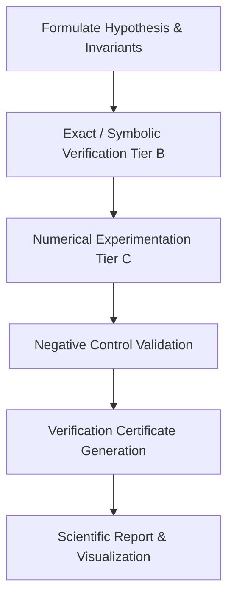

# Antigravity for Science Workflow Guide

Based on the [GDG AI for Science](https://gdgaiforscience.github.io/Antigravity/) guidelines and Google DeepMind AI for Science frameworks.

## 1. Core Principles for AI-Assisted Science

1. **Grounded Scientific Hypothesis Testing**:
   - Always state assumptions, parameter spaces, physical boundary conditions, and invariant conservations before launching numerical experiments.
   - Formulate both positive test criteria and explicit **negative controls** to prevent confirmation bias.

2. **Automated Scientific Data Exploration & Wrangling**:
   - Inspect raw data distribution, missing values, coordinate systems, and physical dimensions.
   - Validate conservation laws (mass, momentum, enstrophy, charge, Hamiltonian energy).

3. **High-Performance Numerical Architecture (HPC / GPU)**:
   - Vectorize inner loops with NumPy/PyTorch/SciPy.
   - For stiff systems, use Exponential Time Differencing (ETD) or Integrating Factor methods rather than naive small-dt explicit Euler/RK4.
   - Ensure boundary and spectral dealiasing (e.g. Orszag 2/3 rule) are applied in Fourier space.

4. **Reproducible Visualizations & Artifacts**:
   - Generate publication-quality figures using consistent colormaps (e.g., `viridis`, `plasma`, `cividis`).
   - Save figures to `figures/` with high resolution (DPI $\ge 200$) and record benchmark parameters into structured JSON metadata (`data/*.json`).

## 2. Standard Scientific Execution Cycle

## 3. Toolchain & Dependencies

- Use `uv` or standard Python virtual environments for fast, reproducible dependency resolution.
- Never write credentials into code; use `.env` files or secure environment variables.
- When generating scientific reports, embed verified figures and link directly to generated data certificates.
