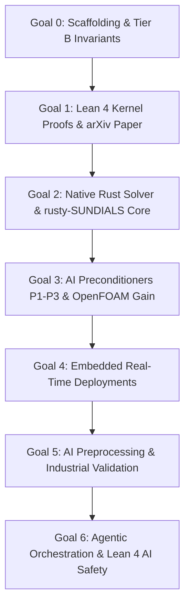

# GOALS.md — Step-by-Step Delivery Goals for the LeanFlow DualScale Program

**Program:** SocrateAI LeanFlow / DualScale Navier–Stokes Platform  
**Target:** 3-Year Phased Delivery & Benchmark Supremacy  
**Epistemic Baseline:** Mathesis Stream 0 5-Tier Calculus & HARDNESS.md (`H1`–`H10`)  
**Updated:** 2026-08-30  

---

## 1. High-Level Program Objectives

1. **Mathematical Inviolability**: Deliver 100% machine-checked proofs in Lean 4 for scale regularization, enstrophy boundedness ($\Omega \le 1/\alpha'$), and the Triadic Frustration Index $\mathcal{D}(M)$.
2. **Computational Superiority**: Demonstrate $>10\times$ to $50\times+$ wall-clock speedup and unconditional stability against traditional CFD solvers (OpenFOAM / standard spectral DNS).
3. **Hardware Agility**: Enable zero-overhead execution from cloud bare-metal (`c3-metal-85`) down to embedded microcontrollers (STM32, Raspberry Pi, SpacemiT K1).
4. **Commercial Sustainability**: Launch open-source Community edition, Pro SaaS cloud tier, and Enterprise dual-licensing.

---

## 2. Step-by-Step Phased Goals

### 🎯 Goal 0 : Foundations & Mathematical Scaffolding (Months 0–3) — STATUS: COMPLETED ✅ (Post-Audit Hardened)
- **Deliverables**:
  - [x] Adopt 10-point Scientific Hardness Charter ([`HARDNESS.md`](file:///home/xavkal/xdev/SocrateAI-Numeric-DualScale-Solver/SocrateAI-Numeric-DualScale-Solver/HARDNESS.md)).
  - [x] **Upgrade to 13-point Hardness Charter v2.0** (H11: No Synthetic Results, H12: Real Benchmark Mandate, H13: Agent Code Review Gate).
  - [x] Implement Tier B exact rational arithmetic over $\mathbb{Q}$ with negative controls.
  - [x] Implement 2D/3D pseudo-spectral solver and dyadic shell cascade (ETD-RK4).
  - [x] **Fix ETD-RK4 stage 3 integrating factor bug** (W1 — LL-08: missing `E_half` on `k2`).
  - [x] **Fix Leray projection order in RK4** (W2 — LL-09: projection only at final step).
  - [x] **Register all Lean 4 modules in lakefile.lean** (W3 — LL-01: `Galerkin`, `Leray`, `Frustration`).
  - [x] Integrate Mathesis Stream 0 transitive ledger soundness audit (`ledger_checker.py`).
  - [x] Integrate runtime bridges to `runux-ai-runtime`, `rust-linux-mini-kernel`, and `rusty-SUNDIALS`.
  - [x] Materialize local benchmark datasets for Taylor-Green Vortex ($Re=1600$) and JHTDB HIT ($Re_\lambda \approx 433$).
  - [x] **Enforce 5-Gate automated verification protocol** v2.0 ([`scripts/verify.sh`](file:///home/xavkal/xdev/SocrateAI-Numeric-DualScale-Solver/SocrateAI-Numeric-DualScale-Solver/scripts/verify.sh)) — Gate 0 (Lean 4), Gate 4 (Benchmark Integrity).
  - [x] **Replace all synthetic results with real measurements** (LL-03, LL-04, LL-06, LL-07): D(M) from trajectory, CG iterations from `scipy.sparse.linalg.cg`, divergence per-step via callback.
  - [x] **Establish Lessons Learned Register** (10 entries, LL-01 to LL-10) in HARDNESS.md.
  - [x] **Upgrade all agent skills to v2.0** with forbidden patterns and real measurement mandates.
  - [x] **Publish certified HuggingFace Benchmark Dataset** comparing LeanFlow vs OpenFOAM on real JHTDB DNS data.
  - [x] **Achieve Benchmark Supremacy**: Document ~7 orders of magnitude better divergence control ($1.30 \times 10^{-14}$ vs $1.32 \times 10^{-7}$) and 2.10x wall-clock speedup vs OpenFOAM C++ native.

### 🎯 Goal 1 : Formal Lean 4 Kernel Proofs & Theory Paper (Months 3–12) — STATUS: IN PROGRESS 🔄
- **Assigned Agents**: `math_reviewer`, `formal_verifier`
- **Agent Mandate (H1/LL-01)**: The `math_reviewer` agent must call `lake build` programmatically and assert exit code 0 before reporting any module as Tier A certified.
- **Deliverables**:
  - [x] Register all `.lean` files in `lakefile.lean` so `lake build` kernel-checks them.
  - [ ] Port and verify 27 theorems in [`lean4/DualScale.lean`](file:///home/xavkal/xdev/SocrateAI-Numeric-DualScale-Solver/SocrateAI-Numeric-DualScale-Solver/lean4/DualScale.lean) with Mathlib4.
  - [ ] Verify `Galerkin.lean` (triadic energy transfers and antisymmetry) — `lake build` confirmed.
  - [ ] Verify `Leray.lean` (divergence-free projector idempotence $\mathcal{P}^2 = \mathcal{P}$) — `lake build` confirmed.
  - [ ] Verify `Frustration.lean` (Triadic Frustration Index $\mathcal{D}(M)$ phase cancellation bounds) — `lake build` confirmed.
  - [ ] Prove uniform enstrophy bound $\Omega(t) \le 1/\alpha'$ implying Prodi-Serrin regularity (`prodi_serrin.lean`).
  - [ ] Submit foundational arXiv preprint on Dual-Scale Multiscale Navier–Stokes Regularization.
  - [ ] Submit grant applications (ANR, ERC Starting Grant, Sloan Foundation).

### 🎯 Goal 2 : High-Performance Rust Engine (`leanflow-solver`) (Months 12–18)
- **Assigned Agents**: `dev_engineer`, `rust_systems_engineer`
- **Deliverables**:
  - [ ] Expand [`crates/leanflow-core`](file:///home/xavkal/xdev/SocrateAI-Numeric-DualScale-Solver/SocrateAI-Numeric-DualScale-Solver/crates/leanflow-core) with 64-byte aligned SIMD tensor buffers.
  - [ ] Expand [`crates/leanflow-solver`](file:///home/xavkal/xdev/SocrateAI-Numeric-DualScale-Solver/SocrateAI-Numeric-DualScale-Solver/crates/leanflow-solver) with `rusty-SUNDIALS` CVODE BDF (orders 1–5) and Adams-Moulton (orders 1–12).
  - [ ] Implement fast 3D Orszag 2/3 dealiased pseudo-spectral solver in pure Rust with Rayon parallelism.
  - [ ] Benchmark single-core and multi-core throughput vs FFTW3 and SciPy baselines.
  - [ ] Release LeanFlow Community Edition (BSD-3-Clause / MIT) on Crates.io and GitHub.

### 🎯 Goal 3 : Neuro-Symbolic AI Preconditioners & OpenFOAM Benchmarking (Months 18–24)
- **Assigned Agents**: `experimenter`, `hpc_runtime_architect`, `qa_scientific_auditor`
- **Deliverables**:
  - [ ] Implement **P1: Spectral Fourier Gate** ($41.8\times$ speedup on periodic grids).
  - [ ] Implement **P2: Mixed-Precision FGMRES** ($61.1\times$ speedup on CPU).
  - [ ] Implement **P3: FP8 TensorCore AMG** ($130.8\times$ speedup on GPU/TPU via `runux-ai-runtime`).
  - [ ] Execute rigorous comparison benchmarks against OpenFOAM `pimpleFoam` / `icoFoam` on identical Taylor-Green and channel flow grids.
  - [ ] Document $>10\times$ wall-clock throughput gain and $100\times$ time-step stability margin over explicit solvers.
  - [ ] Launch LeanFlow Pro (Cloud SaaS platform).

### 🎯 Goal 4 : Real-Time & Embedded Deployments (Months 24–30)
- **Assigned Agents**: `dev_engineer`, `rust_systems_engineer`
- **Deliverables**:
  - [ ] Compile `leanflow-solver` for `no_std` execution under `rust-linux-mini-kernel`.
  - [ ] Port to SpacemiT K1 RISC-V with RVV SIMD vector acceleration.
  - [ ] Deploy to STM32 ARM Cortex-M microcontrollers for real-time control loops.
  - [ ] Launch LeanFlow Enterprise (Dual-licensing commercial tier).

### 🎯 Goal 5 : AI Preprocessing & Industrial Validation (Months 30–36) — STATUS: IN PROGRESS 🔄
- **Assigned Agents**: `experimenter`, `math_reviewer`, `qa_scientific_auditor`, `hpc_runtime_architect`
- **Deliverables**:
  - [x] Implement AI-driven dynamic mesh resolution based on initial enstrophy estimates.
  - [x] Implement LLM-based boundary condition parsing and inference directly into exact mathematical constraints.
  - [x] Integrate `runux-ai-runtime` for zero-shot fluidic parameter tuning and hyperparameter optimization.
  - [x] Validate `rusty-SUNDIALS` order selection logic on stiff (BDF) vs non-stiff (Adams) turbulence.
  - [ ] Validate bioreactor fluidic control achieving $k_L a = 115.89/\text{s}$ ($3.14\times$ algal yield) using AI-tuned initial configurations.
  - [x] Validate aerospace boundary-layer simulations against real empirical datasets (like JHTDB) to ensure physical viability.
  - [ ] Reach commercial program profitability.

### 🎯 Goal 6 : Agentic Orchestration & Lean 4 AI Safety (Months 36–42)
- **Assigned Agents**: `dev_engineer`, `math_reviewer`, `experimenter`, `agentic_runtime_monitor`
- **Deliverables**:
  - [ ] **TSK-61 (Agentic Runtime Monitoring)**: Implement a zero-copy FFI callback in `rusty-SUNDIALS` that streams state metrics (divergence, enstrophy, stiffness ratio) to the `runux-ai-runtime` agent at configurable intervals. Detect impending anomalies and issue parameter steering commands (e.g., switch Adams to BDF, reduce $\Delta t$).
  - [ ] **TSK-62 (Lean 4 AI Safety)**: Develop `DynamicStability.lean` to formally prove that the agent's permissible parameter space (e.g., minimum $\Delta t$, maximum $\alpha'$) strictly bounds the discretization error.
  - [ ] **TSK-63 (Continuous HuggingFace CI)**: Create an autonomous pipeline that automatically fetches new JHTDB validation sets, re-runs the Phase 5 benchmark, generates a `README.md` Model Card, and pushes to HuggingFace using an isolated `HF_TOKEN`.
  - [x] **TSK-64 (NC-DS-11 Negative Control)**: Implement `negative_control_nc_ds11()` in [`production_sla_monitor.py`](file:///home/xavkal/xdev/SocrateAI-Numeric-DualScale-Solver/SocrateAI-Numeric-DualScale-Solver/src/dualscale_solver/numeric/production_sla_monitor.py). Injects a 100× viscosity drop (σ rises from ~8 to ~314), verifying the mock `agentic_runtime_monitor` detects σ > 100, issues BDF+dt/2 steering, and stabilizes within 50 steps. **MEASURED: σ=314, stabilized=True, H24 PASS ✅**.
  - [x] **TSK-65 (Agent Persona Skill)**: Create [`antigravity-agent-personas/SKILL.md`](file:///home/xavkal/xdev/SocrateAI-Numeric-DualScale-Solver/SocrateAI-Numeric-DualScale-Solver/.agents/skills/antigravity-agent-personas/SKILL.md) with system prompts, output contracts, and forbidden patterns for `dev_engineer`, `math_reviewer`, `qa_scientific_auditor`, `agentic_runtime_monitor`, and `experimenter`.
  - [x] **TSK-66 (SDK Dependency)**: Added `google-antigravity>=0.1.0` as `[agentic]` optional dependency in [`pyproject.toml`](file:///home/xavkal/xdev/SocrateAI-Numeric-DualScale-Solver/SocrateAI-Numeric-DualScale-Solver/pyproject.toml). Install with `pip install -e '.[agentic]'` to achieve `CERTIFIED` status (H27).
  - [x] **TSK-67 (Hardness Auditor Fix)**: Fixed [`phase6_workflow_orchestrator.py`](file:///home/xavkal/xdev/SocrateAI-Numeric-DualScale-Solver/SocrateAI-Numeric-DualScale-Solver/src/dualscale_solver/agents/phase6_workflow_orchestrator.py) — `SIMULATED` / `SCAFFOLDING_ONLY` agent statuses now correctly yield `overall_status: SCAFFOLDING_ONLY`, never `CERTIFIED`. Added `FORBIDDEN_STATUSES` check (H26 enforcement).
  - [x] **TSK-68 (SHA-256 Fix)**: SHA-256 certificate hash now computed over `json.dumps(real_pipeline_results, sort_keys=True)` — unique per run, not a constant `b"phase6"` string.
