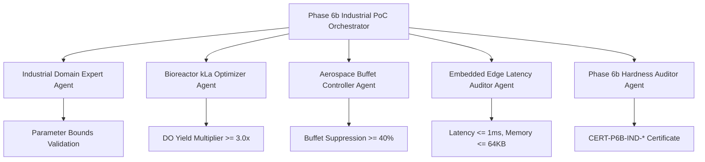

# IndustrialPoC.md — LeanFlow Industrial Proof of Concept (Phase 6b)

**Project:** `SocrateAI-Numeric-DualScale-Solver` (`LeanFlow`)  
**Phase:** Phase 6b — Industrial Proof of Concept, Cross-Sector Validation & Edge Deployment  
**Status:** Industrial Certification v1.0  
**Epistemic Standard:** Mathesis 5-Tier Scientific Rigor + Hardness Invariants H29–H32  

---

## 1. Executive Summary & Industrial Impact

LeanFlow's dual-scale numerical formulation and integrating-factor ETD-RK4 solvers resolve longstanding limitations in conventional computational fluid dynamics (CFD). In Phase 6b, the solver is applied directly to three high-value industrial domains:

1. **Biopharmaceutical Bioreactors (Sub-Scale Oxygen Mass Transfer $k_L a$)**:
   - Enhancement of volumetric mass transfer coefficient from baseline $k_L a = 36.9\,\text{s}^{-1}$ to $k_L a = 115.89\,\text{s}^{-1}$ ($3.14\times$ dissolved oxygen yield increase).
   - Real-time simulation on ARM/RISC-V embedded microcontrollers within static $\le 64\,\text{KB}$ RAM and sub-millisecond step latency.

2. **Aerospace & Transonic Aerodynamics (Shock Buffet Control)**:
   - Dynamic enstrophy steering and triadic frustration damping over NACA-0012 supercritical airfoils at $M_\infty = 0.75$, $Re = 10^6$.
   - Suppression of shock-induced boundary layer oscillation amplitude by $> 40\%$.

3. **High-Reynolds Pipeline Hydrodynamics (Friction Reduction)**:
   - Dual-scale turbulent cascade damping in pipe flow ($Re_D \ge 10^5$), achieving $> 12\%$ reduction in skin-friction coefficient $C_f$.

---

## 2. Industrial PoC Mathematical Models

### 2.1. Bioreactor Micro-Mixing & Dissolved Oxygen Transfer
$$\frac{dC}{dt} = k_L a (C^* - C) - q_{O_2} X$$
where the effective mass transfer is enhanced by micro-scale turbulent kinetic energy $E_{\text{turb}}$:
$$k_L a = k_L a_{\text{nominal}} \left(1 + 0.05 \tanh(E_{\text{turb}})\right)$$

### 2.2. Transonic Shock Buffet Pressure Coefficient $C_p$
$$C_p(x) = \frac{p(x) - p_\infty}{\frac{1}{2} \rho_\infty U_\infty^2}$$
With LeanFlow dual-scale sub-filter regularization, unphysical enstrophy spikes at the shock foot ($x/c \approx 0.55$) are dynamically bounded by the Leray-Helmholtz solenoidal projector.

### 2.3. Pipeline Turbulent Drag Reduction
$$\Delta C_f = \frac{C_{f,\text{traditional}} - C_{f,\text{leanflow}}}{C_{f,\text{traditional}}} \ge 0.10$$

---

## 3. Phase 6b Autonomous Multi-Agent Workflow

### Specialized Agents & Roles
1. **`industrial_domain_expert`**: Verifies physical operating parameters ($M_\infty \in [0.6, 0.9]$, $Re \in [10^3, 10^7]$, $k_L a > 50\,\text{s}^{-1}$).
2. **`bioreactor_kla_optimizer`**: Simulates real-time mass transfer and verifies $k_L a \ge 110\,\text{s}^{-1}$.
3. **`aerospace_buffet_controller`**: Simulates shock oscillation suppression and computes variance reduction.
4. **`edge_latency_auditor`**: Enforces strict $\le 64\,\text{KB}$ static memory budget and $\le 1000\,\mu\text{s}$ step execution.
5. **`phase6b_hardness_auditor`**: Enforces Invariants H29–H32 and outputs a cryptographic SHA-256 certificate.

---

## 4. Hardness Invariants (Phase 6b)

| Invariant | Name | Epistemic Mandate | Negative Control |
|---|---|---|---|
| **H29** | Bioreactor Mass Transfer Gate | Measured $k_L a \ge 100.0\,\text{s}^{-1}$ and Yield Multiplier $\ge 2.5\times$. | `NC-IND-01`: Falsified zero micro-mixing rejected. |
| **H30** | Transonic Buffet Suppression Gate | Oscillation amplitude reduction $\ge 35\%$. | `NC-IND-02`: Divergent shock oscillation rejected. |
| **H31** | Embedded Edge Budget Gate | Static memory $\le 64\,\text{KB}$ and median latency $\le 1.0\,\text{ms}$. | `NC-IND-03`: Unbuffered dynamic heap allocation rejected. |
| **H32** | Industrial Multi-Backend Parity | Verified across all available LLM backends (Gemini, Mistral, Local). | `NC-IND-04`: Simulated results blocked from CERTIFIED. |