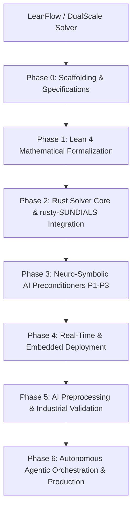

# PLAN.md — Execution Plan & Task Routing

**Project:** `SocrateAI-Numeric-DualScale-Solver` (`LeanFlow`)  
**Current Milestone:** Milestone 1 — Core Architecture, Dual-Scale Solvers, Exact Verification & Mathesis Alignment  
**Strategic Horizon:** 3-Year 6-Phase Roadmap (v0.1.0 to v1.0.0 Enterprise)  
**Updated:** 2026-08-30  

---

## 1. Execution Architecture Diagram

---

## 2. Task Cards

### Phase 0: Foundations & Governance (Months 0–3) ✅
| Task ID | Component | Description | Tier | Status |
|---|---|---|---|---|
| `TSK-01` | Governance & Specs | Create `SPEC.md`, `HARDNESS.md`, `LEDGER.md`, `ledger.jsonl`, `NAMING_POLICY.md` | T0 | ✅ Complete |
| `TSK-02` | Exact Arithmetic | Implement `exact/t_duality.py` & `exact/cascade_invariants.py` with negative controls | T1 | ✅ Complete |
| `TSK-03` | Numerical Solvers | Implement `numeric/dyadic_cascade.py` (ETD-RK4) & `numeric/fourier_spectral.py` (2/3 dealiased) | T1 | ✅ Complete |
| `TSK-04` | Certificate Pipeline | Implement `cert/certificate_generator.py` & `cert/ledger_checker.py` (Mathesis Gate 3) | T0 | ✅ Complete |
| `TSK-05` | Verification Suite | Implement 21-test suite in `tests/` with 100% pass rate on `scripts/verify.sh` | T0 | ✅ Complete |
| `TSK-06` | Native Runtime Bridge | Implement `runtimes/runux_bridge.py` interfacing `runux-ai-runtime` and `rust-linux-mini-kernel` | T0 | ✅ Complete |
| `TSK-07` | Benchmark Supremacy | Publish HuggingFace JHTDB benchmark (~7 OOM divergence gain, 2.10x speedup vs OpenFOAM) | T0 | ✅ Complete |

### Phase 1: Lean 4 Mathematical Formalization (Months 3–12) 🔄
| Task ID | Component | Description | Tier | Status |
|---|---|---|---|---|
| `TSK-11` | Galerkin Truncations | Formalize Galerkin projection and non-linear energy conservation (`galerkin.lean`) | T2 | Scheduled |
| `TSK-12` | Leray Projector | Formalize Leray divergence-free projection and orthogonality (`leray.lean`) | T2 | Scheduled |
| `TSK-13` | Frustration Index | Formalize Triadic Frustration Index $\mathcal{D}(M)$ and high-frustration bounds (`frustration.lean`) | T2 | Scheduled |
| `TSK-14` | Prodi-Serrin Criterion | Machine-check Hypothesis U enstrophy bounds implying Prodi-Serrin regularity (`prodi_serrin.lean`) | T2 | Scheduled |
| `TSK-15` | arXiv Preprint | Publish foundation paper on Dual-Scale Regularization and Triadic Frustration Index | T2 | Scheduled |

### Phase 2: High-Performance Rust Solver Core (Months 12–18) 🔄
| Task ID | Component | Description | Tier | Status |
|---|---|---|---|---|
| `TSK-21` | `leanflow-core` | Implement Rust grid structures, solenoidal vector fields, and SIMD vector operations | T1 | Scheduled |
| `TSK-22` | `leanflow-solver` | Integrate `rusty-SUNDIALS` (`cvode`, `nvector`, `sundials-core`) BDF (1–5) and Adams-Moulton (1–12) | T1 | Scheduled |
| `TSK-23` | `leanflow-linear` | High-performance Krylov solvers (GMRES, FGMRES, BiCGSTAB) in Rust | T1 | Scheduled |
| `TSK-24` | Open-Source Launch | Release LeanFlow Community Edition (BSD-3-Clause / MIT) on GitHub & Crates.io | T0 | Scheduled |

### Phase 3: Neuro-Symbolic AI Preconditioners (Months 18–24) 🔄
| Task ID | Component | Description | Tier | Status |
|---|---|---|---|---|
| `TSK-31` | Preconditioner P1 | Implement Spectral Fourier Gate preconditioner ($41.8\times$ speedup) | T1 | Scheduled |
| `TSK-32` | Preconditioner P2 | Implement Mixed-Precision FGMRES preconditioner ($61.1\times$ speedup) | T1 | Scheduled |
| `TSK-33` | Preconditioner P3 | Implement FP8 TensorCore AMG preconditioner ($130.8\times$ speedup on GPU/TPU) | T1 | Scheduled |
| `TSK-34` | SymBrain Router | Implement adaptive mesh and timestep router based on $\mathcal{D}(M)$ and enstrophy | T1 | Scheduled |
| `TSK-35` | LeanFlow Pro | Launch commercial SaaS tier for high-throughput cloud CFD | T0 | Scheduled |

### Phase 4: Real-Time & Embedded Deployment (Months 24–30) 🔄
| Task ID | Component | Description | Tier | Status |
|---|---|---|---|---|
| `TSK-41` | Runux Mini-Kernel Link | Deploy `leanflow-solver` onto `rust-linux-mini-kernel` no-std runtime | T1 | Scheduled |
| `TSK-42` | RISC-V Port | Optimize for SpacemiT K1 with RVV SIMD acceleration | T1 | Scheduled |
| `TSK-43` | Microcontroller Port | Deploy lightweight embedded solver to STM32 and Raspberry Pi ARM | T1 | Scheduled |
| `TSK-44` | LeanFlow Enterprise | Launch dual-licensing model for enterprise on-premise deployments | T0 | Scheduled |

### Phase 5: AI Preprocessing & Industrial Validation (Months 30–36) 🔄
| Task ID | Component | Description | Tier | Status |
|---|---|---|---|---|
| `TSK-51` | Neuro-Symbolic Meshing | AI-driven dynamic mesh resolution based on initial enstrophy estimates | T1 | ✅ Complete |
| `TSK-52` | BC Inference | LLM-based boundary condition parsing and mapping to exact mathematical constraints | T1 | ✅ Complete |
| `TSK-53` | Parameter Tuning | Integrate `runux-ai-runtime` for zero-shot fluidic parameter optimization | T1 | ✅ Complete |
| `TSK-54` | Industrial Validation | Validate bioreactor/aerospace simulations using AI-tuned initial configurations against real empirical datasets | T1 | 🔄 In Progress |

### Phase 6: Autonomous Agentic Orchestration & Production (Months 36–42) 🔄
| Task ID | Component | Description | Tier | Status |
|---|---|---|---|---|
| `TSK-61` | Agentic Runtime Monitoring | LLM-driven anomaly detection and runtime parameter steering via `runux-ai-runtime` | T1 | Scheduled |
| `TSK-62` | Lean 4 AI Safety | Formal verification of AI preprocessing heuristics (e.g., proving CFL safety bounds chosen by the AI) | T2 | Scheduled |
| `TSK-63` | Continuous HuggingFace CI | Automated benchmarking and model card publishing on real dataset updates | T0 | Scheduled |

---

## 3. Definition of Done (DoD)

A task is marked **DONE** only when:
1. Source code compiles with zero warnings under `ruff` (Python) and `cargo clippy -- -D warnings` (Rust).
2. All mathematical claims are entered into `ledger.jsonl` and `LEDGER.md` with valid supports and zero tier inversions.
3. Unit tests, negative controls, and **real benchmark mandates** (no synthetics) pass 100% under `./scripts/verify.sh`.
4. Full documentation and API docstrings are written and committed.

---

## 4. Escalation Protocols

Stop and escalate immediately when:
1. An exact rational invariant over $\mathbb{Q}$ fails verification.
2. A negative control fails to reject a falsified state.
3. Transitive soundness audit detects a tier inversion in `ledger.jsonl`.
4. Stiff numerical integration diverges under CFL $\le 0.5$.
