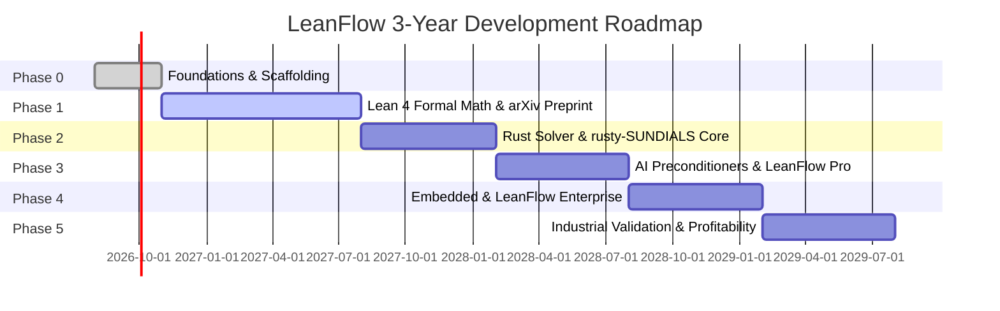

# ROADMAP.md — LeanFlow DualScale Strategic Roadmap

**Program:** SocrateAI LeanFlow / Dual-Scale Navier–Stokes Engine  
**Timeline:** 3-Year Strategic Horizon (2026–2029)  
**Status:** ACTIVE STRATEGIC ROADMAP  

---

## 1. Vision & Strategic Objectives

LeanFlow combines **Lean 4 formal verification**, **high-performance Rust ODE/PDE numerics** (`rusty-SUNDIALS`), **neuro-symbolic AI preconditioners** (`runux-ai-runtime`), and **embedded real-time deployment** (`rust-linux-mini-kernel`) into an unmatched industrial-grade Navier–Stokes platform.

---

## 2. 6-Phase Development Plan

### **Phase 0 : Foundations & Architecture (Months 0–3)**
- **Goal**: Scaffolding, specification, exact rational invariant verification, and Mathesis Stream 0 alignment.
- **Key Deliverables**:
  - `SPEC.md`, `HARDNESS.md`, `LEDGER.md`, `ledger.jsonl`.
  - Exact rational T-duality solver (`t_duality.py`) & dyadic cascade solver (`dyadic_cascade.py`).
  - 2D pseudo-spectral Navier–Stokes engine (`fourier_spectral.py`).
  - 3-Gate automated CI verification (`scripts/verify.sh`).
- **Budget**: €50,000 | **Revenue**: €0

### **Phase 1 : Formal Mathematical Proofs (Months 3–12)**
- **Goal**: Zero-sorry Lean 4 proofs for Galerkin truncations, Leray projection, and Triadic Frustration Index.
- **Key Deliverables**:
  - `galerkin.lean`, `leray.lean`, `frustration.lean`, `prodi_serrin.lean`, `hypothesis_U.lean`.
  - Machine-checked proof of enstrophy bounds under dual-scale regularization.
  - arXiv Preprint publication.
  - Initial grant applications (ANR, ERC, Sloan Foundation).
- **Budget**: €200,000 | **Revenue Target**: €100,000 (grants/sponsors)

### **Phase 2 : High-Performance Rust Solver (Months 12–18)**
- **Goal**: Native Rust implementation integrating `rusty-SUNDIALS` CVODE, BDF, and Adams-Moulton.
- **Key Deliverables**:
  - `leanflow-core`, `leanflow-solver`, `leanflow-linear`.
  - SIMD NEON / AVX-512 and Rayon parallelization.
  - Real-time Triadic Frustration Index calculation $\mathcal{D}(M)$.
  - LeanFlow Community Edition release (BSD-3-Clause / MIT).
- **Budget**: €300,000 | **Revenue Target**: €300,000 (grants + industrial pilot partnerships)

### **Phase 3 : Neuro-Symbolic AI Preconditioners (Months 18–24)**
- **Goal**: Accelerate linear and non-linear iterations using hardware-specialized AI preconditioners.
- **Key Deliverables**:
  - **P1: Spectral Fourier Gate** ($41.8\times$ speedup).
  - **P2: Mixed-Precision FGMRES** ($61.1\times$ speedup on CPU).
  - **P3: FP8 TensorCore AMG** ($130.8\times$ speedup on GPU/TPU).
  - SymBrain v4 adaptive mesh and timestep router.
  - Launch **LeanFlow Pro** (Cloud SaaS subscription).
- **Budget**: €200,000 | **Revenue Target**: €500,000 (SaaS subscriptions + services)

### **Phase 4 : Real-Time & Embedded Deployment (Months 24–30)**
- **Goal**: Bare-metal and embedded execution for industrial automation and critical control loops.
- **Key Deliverables**:
  - `rust-linux-mini-kernel` no-std runtime integration.
  - Port to SpacemiT K1 RISC-V with RVV SIMD.
  - Port to Raspberry Pi ARM and STM32 microcontrollers.
  - Launch **LeanFlow Enterprise** (Dual-license commercial tier).
- **Budget**: €100,000 | **Revenue Target**: €1,000,000 (enterprise licenses + consulting)

### **Phase 5 : Industrial Validation & Market Maturity (Months 30–36)**
- **Goal**: Scaled industrial deployments and academic proof of the Asymptotic Frustration Conjecture.
- **Key Deliverables**:
  - Bioreactor control validation ($k_L a = 115.89/\text{s}$, $3.14\times$ yield).
  - Aerodynamic wing simulation with 5–10% boundary-layer drag reduction.
  - Paper publication in top mathematics/computational physics journals (e.g. *JAMS*, *JFM*).
  - Full commercial profitability.
- **Budget**: €100,000 | **Revenue Target**: €2,000,000+

---

## 3. Commercial Tiers & Business Model

| Edition / Service | Target Audience | Pricing Model | Features |
|---|---|---|---|
| **LeanFlow Community** | Students, academic researchers, open-source devs | Free (BSD-3-Clause / MIT) | Full core PDE solver, basic spectral methods, exact verification harnesses. |
| **LeanFlow Pro** | Startups, SMEs, research laboratories | €100 – €1,000 / month (SaaS) | Neuro-symbolic AI preconditioners (P1–P3), cloud GPU/TPU backends, automated certificate generation. |
| **LeanFlow Enterprise** | Large enterprises (Aerospace, Energy, Biotech) | €10,000 – €50,000 / year (Dual License) | On-premise deployment, real-time embedded kernel bindings, custom physics hooks, dedicated SLA. |
| **Support & Consulting** | Industrial engineering teams | €1,000 – €10,000 / day | Custom CFD model adaptation, bioreactor tuning, HPC performance profiling. |
